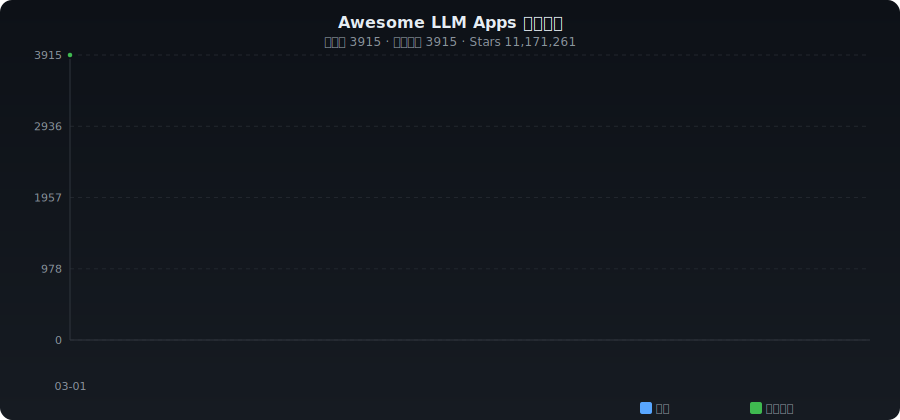

# ✨ Awesome LLM Apps

**English** | [中文](./README_ZH.md)

> Curated collection of LLM applications, tools & SDKs — auto-collected from GitHub

   

---

## 📈 Trends

---

## 📊 Category Stats

| Category | Count | Share |
|----------|------:|------:|
| 🧠 Open Source Models | 1303 | ███████████ 33.3% |
| 🚀 Inference & Deployment | 356 | ███ 9.1% |
| 🎯 Fine-tuning & Training | 278 | ██ 7.1% |
| 🏗️ Development Frameworks | 375 | ███ 9.6% |
| 🔌 Gateway & Proxy | 184 | █ 4.7% |
| 🛠️ App Builders | 259 | ██ 6.6% |
| 📊 Evaluation & Observability | 331 | ██ 8.5% |
| 📚 Knowledge & RAG | 311 | ██ 7.9% |
| 🛡️ Safety & Alignment | 16 | █ 0.4% |
| 📦 Others | 502 | ████ 12.8% |

---

## 🔥 Daily Trending (2026-03-01)

| # | Project | ⭐ | 📈 Gain | Description |
|:-:|---------|---:|-------:|-------------|
| 1 | [RightNow-AI/openfang](https://github.com/RightNow-AI/openfang) | 6,910 | +495 | Open-source Agent Operating System |
| 2 | [alibaba/OpenSandbox](https://github.com/alibaba/OpenSandbox) | 3,057 | +290 | OpenSandbox is a general-purpose sandbox platform for AI app |
| 3 | [block/goose](https://github.com/block/goose) | 31,848 | +224 | an open source, extensible AI agent that goes beyond code su |
| 4 | [Shubhamsaboo/awesome-llm-apps](https://github.com/Shubhamsaboo/awesome-llm-apps) | 98,535 | +120 | Collection of awesome LLM apps with AI Agents and RAG using  |
| 5 | [cheahjs/free-llm-api-resources](https://github.com/cheahjs/free-llm-api-resources) | 13,242 | +88 | A list of free LLM inference resources accessible via API. |
| 6 | [firecrawl/firecrawl](https://github.com/firecrawl/firecrawl) | 86,951 | +83 | 🔥 The Web Data API for AI - Turn entire websites into LLM-re |
| 7 | [badlogic/pi-mono](https://github.com/badlogic/pi-mono) | 18,382 | +78 | AI agent toolkit: coding agent CLI, unified LLM API, TUI & w |
| 8 | [bytedance/deer-flow](https://github.com/bytedance/deer-flow) | 22,829 | +76 | An open-source SuperAgent harness that researches, codes, an |
| 9 | [f/prompts.chat](https://github.com/f/prompts.chat) | 149,443 | +70 | f.k.a. Awesome ChatGPT Prompts. Share, discover, and collect |
| 10 | [ashishpatel26/500-AI-Agents-Projects](https://github.com/ashishpatel26/500-AI-Agents-Projects) | 25,182 | +58 | The 500 AI Agents Projects is a curated collection of AI age |
| 11 | [lyogavin/airllm](https://github.com/lyogavin/airllm) | 13,028 | +58 | AirLLM 70B inference with single 4GB GPU |
| 12 | [AstrBotDevs/AstrBot](https://github.com/AstrBotDevs/AstrBot) | 18,448 | +45 | Agentic IM Chatbot infrastructure that integrates lots of IM |
| 13 | [iOfficeAI/AionUi](https://github.com/iOfficeAI/AionUi) | 17,502 | +40 | Free, local, open-source 24/7 Cowork app and OpenClaw for Ge |
| 14 | [hesreallyhim/awesome-claude-code](https://github.com/hesreallyhim/awesome-claude-code) | 25,654 | +35 | A curated list of awesome skills, hooks, slash-commands, age |
| 15 | [rtk-ai/rtk](https://github.com/rtk-ai/rtk) | 2,086 | +32 | CLI proxy that reduces LLM token consumption by 60-90% on co |
| 16 | [BerriAI/litellm](https://github.com/BerriAI/litellm) | 37,353 | +26 | Python SDK, Proxy Server (AI Gateway) to call 100+ LLM APIs  |
| 17 | [langchain-ai/langchain](https://github.com/langchain-ai/langchain) | 127,824 | +25 | 🦜🔗 The platform for reliable agents. |
| 18 | [TauricResearch/TradingAgents](https://github.com/TauricResearch/TradingAgents) | 31,022 | +24 | TradingAgents: Multi-Agents LLM Financial Trading Framework |
| 19 | [open-webui/open-webui](https://github.com/open-webui/open-webui) | 125,311 | +23 | User-friendly AI Interface (Supports Ollama, OpenAI API, ... |
| 20 | [QuantumNous/new-api](https://github.com/QuantumNous/new-api) | 18,682 | +22 | A unified AI model hub for aggregation & distribution. It su |

---

## 📁 Categories

- [🧠 Open Source Models](#model) (1303)
- [🚀 Inference & Deployment](#inference) (356)
- [🎯 Fine-tuning & Training](#finetune) (278)
- [🏗️ Development Frameworks](#dev-framework) (375)
- [🔌 Gateway & Proxy](#gateway) (184)
- [🛠️ App Builders](#app-builder) (259)
- [📊 Evaluation & Observability](#eval) (331)
- [📚 Knowledge & RAG](#knowledge) (311)
- [🛡️ Safety & Alignment](#safety) (16)
- [📦 Others](#other) (502)

---

### 🧠 Open Source Models

| Project | ⭐ | Language | Description |
|---------|---:|:--------:|-------------|
| [Significant-Gravitas/Auto-GPT](https://github.com/Significant-Gravitas/AutoGPT) | 182,111 | Python | AutoGPT is the vision of accessible AI for everyone, to use and to bui |
| [ollama/ollama](https://github.com/ollama/ollama) | 163,730 | Go | Get up and running with Kimi-K2.5, GLM-5, MiniMax, DeepSeek, gpt-oss,  |
| [huggingface/transformers](https://github.com/huggingface/transformers) | 157,160 | Python | 🤗 Transformers: the model-definition framework for state-of-the-art ma |
| [microsoft/generative-ai-for-beginners](https://github.com/microsoft/generative-ai-for-beginners) | 107,298 | Jupyter Notebook | 21 Lessons, Get Started Building with Generative AI |
| [deepseek-ai/DeepSeek-V3](https://github.com/deepseek-ai/DeepSeek-V3) | 101,810 | Python |  |
| [Shubhamsaboo/awesome-llm-apps](https://github.com/Shubhamsaboo/awesome-llm-apps) | 98,535 | Python | Collection of awesome LLM apps with AI Agents and RAG using OpenAI, An |
| [ggml-org/llama.cpp](https://github.com/ggml-org/llama.cpp) | 96,225 | C++ | LLM inference in C/C++ |
| [ggerganov/llama.cpp](https://github.com/ggml-org/llama.cpp) | 96,211 | C++ | LLM inference in C/C++ |
| [deepseek-ai/DeepSeek-R1](https://github.com/deepseek-ai/DeepSeek-R1) | 91,888 | - |  |
| [rasbt/LLMs-from-scratch](https://github.com/rasbt/LLMs-from-scratch) | 86,533 | Jupyter Notebook | Implement a ChatGPT-like LLM in PyTorch from scratch, step by step |
| [mlabonne/llm-course](https://github.com/mlabonne/llm-course) | 75,872 | - | Course to get into Large Language Models (LLMs) with roadmaps and Cola |
| [vllm-project/vllm](https://github.com/vllm-project/vllm) | 71,568 | Python | A high-throughput and memory-efficient inference and serving engine fo |
| [binary-husky/gpt_academic](https://github.com/binary-husky/gpt_academic) | 70,138 | Python | 为GPT/GLM等LLM大语言模型提供实用化交互接口，特别优化论文阅读/润色/写作体验，模块化设计，支持自定义快捷按钮&函数插件，支持Pyt |
| [hiyouga/LlamaFactory](https://github.com/hiyouga/LlamaFactory) | 67,700 | Python | Unified Efficient Fine-Tuning of 100+ LLMs & VLMs (ACL 2024) |
| [hiyouga/LLaMA-Factory](https://github.com/hiyouga/LlamaFactory) | 67,700 | Python | Unified Efficient Fine-Tuning of 100+ LLMs & VLMs (ACL 2024) |
| [hiyouga/LLaMA-Efficient-Tuning](https://github.com/hiyouga/LlamaFactory) | 67,693 | Python | Unified Efficient Fine-Tuning of 100+ LLMs & VLMs (ACL 2024) |
| [Mintplex-Labs/anything-llm](https://github.com/Mintplex-Labs/anything-llm) | 55,227 | JavaScript | The all-in-one Desktop & Docker AI application with built-in RAG, AI a |
| [unslothai/unsloth](https://github.com/unslothai/unsloth) | 52,902 | Python | Fine-tuning & Reinforcement Learning for LLMs. 🦥 Train OpenAI gpt-oss, |
| [joaomdmoura/crewAI](https://github.com/crewAIInc/crewAI) | 44,890 | Python | Framework for orchestrating role-playing, autonomous AI agents. By fos |
| [mudler/LocalAI](https://github.com/mudler/LocalAI) | 43,164 | Go | :robot: The free, Open Source alternative to OpenAI, Claude and others |
| [microsoft/DeepSpeed](https://github.com/deepspeedai/DeepSpeed) | 41,707 | Python | DeepSpeed is a deep learning optimization library that makes distribut |
| [hpcaitech/ColossalAI](https://github.com/hpcaitech/ColossalAI) | 41,363 | Python | Making large AI models cheaper, faster and more accessible |
| [THUDM/ChatGLM-6B](https://github.com/zai-org/ChatGLM-6B) | 41,227 | Python | ChatGLM-6B: An Open Bilingual Dialogue Language Model | 开源双语对话语言模型 |
| [janhq/jan](https://github.com/janhq/jan) | 40,729 | TypeScript | Jan is an open source alternative to ChatGPT that runs 100% offline on |
| [lm-sys/FastChat](https://github.com/lm-sys/FastChat) | 39,421 | Python | An open platform for training, serving, and evaluating large language  |
| [2noise/ChatTTS](https://github.com/2noise/ChatTTS) | 38,831 | Python | A generative speech model for daily dialogue. |
| [mckaywrigley/chatbot-ui](https://github.com/mckaywrigley/chatbot-ui) | 33,052 | TypeScript | AI chat for any model. |
| [khoj-ai/khoj](https://github.com/khoj-ai/khoj) | 32,702 | Python | Your AI second brain. Self-hostable. Get answers from the web or your  |
| [songquanpeng/one-api](https://github.com/songquanpeng/one-api) | 29,949 | JavaScript | LLM API 管理 & 分发系统，支持 OpenAI、Azure、Anthropic Claude、Google Gemini、DeepS |
| [Hannibal046/Awesome-LLM](https://github.com/Hannibal046/Awesome-LLM) | 26,352 | - | Awesome-LLM: a curated list of Large Language Model |
| [huggingface/open-r1](https://github.com/huggingface/open-r1) | 25,911 | Python | Fully open reproduction of DeepSeek-R1 |
| [Fosowl/agenticSeek](https://github.com/Fosowl/agenticSeek) | 25,340 | Python | Fully Local Manus AI. No APIs, No $200 monthly bills. Enjoy an autonom |
| [sgl-project/sglang](https://github.com/sgl-project/sglang) | 23,915 | Python | SGLang is a high-performance serving framework for large language mode |
| [jlowin/fastmcp](https://github.com/PrefectHQ/fastmcp) | 23,261 | Python | 🚀 The fast, Pythonic way to build MCP servers and clients. |
| [handsOnLLM/Hands-On-Large-Language-Models](https://github.com/HandsOnLLM/Hands-On-Large-Language-Models) | 23,149 | Jupyter Notebook | Official code repo for the O'Reilly Book - "Hands-On Large Language Mo |
| [HqWu-HITCS/Awesome-Chinese-LLM](https://github.com/HqWu-HITCS/Awesome-Chinese-LLM) | 22,285 | - | 整理开源的中文大语言模型，以规模较小、可私有化部署、训练成本较低的模型为主，包括底座模型，垂直领域微调及应用，数据集与教程等。 |
| [yamadashy/repomix](https://github.com/yamadashy/repomix) | 22,159 | TypeScript | 📦 Repomix is a powerful tool that packs your entire repository into a  |
| [mlc-ai/mlc-llm](https://github.com/mlc-ai/mlc-llm) | 22,084 | Python | Universal LLM Deployment Engine with ML Compilation |
| [microsoft/unilm](https://github.com/microsoft/unilm) | 22,034 | Python | Large-scale Self-supervised Pre-training Across Tasks, Languages, and  |
| [microsoft/guidance](https://github.com/guidance-ai/guidance) | 21,326 | Jupyter Notebook | A guidance language for controlling large language models. |

---

### 🚀 Inference & Deployment

| Project | ⭐ | Language | Description |
|---------|---:|:--------:|-------------|
| [nomic-ai/gpt4all](https://github.com/nomic-ai/gpt4all) | 77,163 | C++ | GPT4All: Run Local LLMs on Any Device. Open-source and available for c |
| [ray-project/ray](https://github.com/ray-project/ray) | 41,532 | Python | Ray is an AI compute engine. Ray consists of a core distributed runtim |
| [reworkd/AgentGPT](https://github.com/reworkd/AgentGPT) | 35,753 | TypeScript | 🤖 Assemble, configure, and deploy autonomous AI Agents in your browser |
| [microsoft/BitNet](https://github.com/microsoft/BitNet) | 28,652 | Python | Official inference framework for 1-bit LLMs |
| [liguodongiot/llm-action](https://github.com/liguodongiot/llm-action) | 23,267 | HTML | 本项目旨在分享大模型相关技术原理以及实战经验（大模型工程化、大模型应用落地） |
| [FunAudioLLM/CosyVoice](https://github.com/FunAudioLLM/CosyVoice) | 19,761 | Python | Multi-lingual large voice generation model, providing inference, train |
| [badlogic/pi-mono](https://github.com/badlogic/pi-mono) | 18,382 | TypeScript | AI agent toolkit: coding agent CLI, unified LLM API, TUI & web UI libr |
| [kubernetes-sigs/kubespray](https://github.com/kubernetes-sigs/kubespray) | 18,299 | Jinja | Deploy a Production Ready Kubernetes Cluster |
| [labring/sealos](https://github.com/labring/sealos) | 16,980 | TypeScript | Sealos is an AI-native Cloud Operating System built on Kubernetes that |
| [kvcache-ai/ktransformers](https://github.com/kvcache-ai/ktransformers) | 16,639 | Python | A Flexible Framework for Experiencing Heterogeneous LLM Inference/Fine |
| [botpress/botpress](https://github.com/botpress/botpress) | 14,574 | TypeScript | The open-source hub to build & deploy GPT/LLM Agents ⚡️ |
| [Lightning-AI/litgpt](https://github.com/Lightning-AI/litgpt) | 13,199 | Python | 20+ high-performance LLMs with recipes to pretrain, finetune and deplo |
| [NVIDIA/TensorRT-LLM](https://github.com/NVIDIA/TensorRT-LLM) | 12,975 | Python | TensorRT LLM provides users with an easy-to-use Python API to define L |
| [GeeeekExplorer/nano-vllm](https://github.com/GeeeekExplorer/nano-vllm) | 11,909 | Python | Nano vLLM |
| [microsoft/promptflow](https://github.com/microsoft/promptflow) | 11,034 | Python | Build high-quality LLM apps - from prototyping, testing to production  |
| [RunanywhereAI/runanywhere-sdks](https://github.com/RunanywhereAI/runanywhere-sdks) | 10,129 | C++ | Production ready toolkit to run AI locally |
| [skypilot-org/skypilot](https://github.com/skypilot-org/skypilot) | 9,515 | Python | Run, manage, and scale AI workloads on any AI infrastructure. Use one  |
| [krillinai/KrillinAI](https://github.com/krillinai/KrillinAI) | 9,498 | Go | Video translation and dubbing tool powered by LLMs. The video translat |
| [Tiiny-AI/PowerInfer](https://github.com/Tiiny-AI/PowerInfer) | 8,742 | C++ | High-speed Large Language Model Serving for Local Deployment |
| [bentoml/BentoML](https://github.com/bentoml/BentoML) | 8,478 | Python | The easiest way to serve AI apps and models - Build Model Inference AP |
| [InternLM/lmdeploy](https://github.com/InternLM/lmdeploy) | 7,639 | Python | LMDeploy is a toolkit for compressing, deploying, and serving LLMs. |
| [LMCache/LMCache](https://github.com/LMCache/LMCache) | 6,958 | Python | Supercharge Your LLM with the Fastest KV Cache Layer |
| [julep-ai/julep](https://github.com/julep-ai/julep) | 6,608 | Jupyter Notebook | Deploy serverless AI workflows at scale. Firebase for AI agents |
| [microsoft/LLMLingua](https://github.com/microsoft/LLMLingua) | 5,867 | Python | [EMNLP'23, ACL'24] To speed up LLMs' inference and enhance LLM's perce |
| [serge-chat/serge](https://github.com/serge-chat/serge) | 5,746 | Svelte | A web interface for chatting with Alpaca through llama.cpp. Fully dock |
| [katanaml/sparrow](https://github.com/katanaml/sparrow) | 5,126 | Python | Structured data extraction and instruction calling with ML, LLM and Vi |
| [flashinfer-ai/flashinfer](https://github.com/flashinfer-ai/flashinfer) | 5,054 | Python | FlashInfer: Kernel Library for LLM Serving |
| [AutoGPTQ/AutoGPTQ](https://github.com/AutoGPTQ/AutoGPTQ) | 5,027 | Python | An easy-to-use LLMs quantization package with user-friendly apis, base |
| [OpenBMB/AgentVerse](https://github.com/OpenBMB/AgentVerse) | 4,945 | JavaScript | 🤖 AgentVerse 🪐 is designed to facilitate the deployment of multiple LL |
| [kvcache-ai/Mooncake](https://github.com/kvcache-ai/Mooncake) | 4,844 | C++ | Mooncake is the serving platform for Kimi, a leading LLM service provi |
| [lm-sys/RouteLLM](https://github.com/lm-sys/RouteLLM) | 4,647 | Python | A framework for serving and evaluating LLM routers - save LLM costs wi |
| [alirezadir/Production-Level-Deep-Learning](https://github.com/alirezadir/Production-Level-Deep-Learning) | 4,606 | - | A guideline for building practical production-level deep learning syst |
| [cactus-compute/cactus](https://github.com/cactus-compute/cactus) | 4,393 | C | Low-latency AI engine for mobile devices & wearables |
| [OpenNMT/CTranslate2](https://github.com/OpenNMT/CTranslate2) | 4,328 | C++ | Fast inference engine for Transformer models |
| [ModelTC/LightLLM](https://github.com/ModelTC/LightLLM) | 3,919 | Python | LightLLM is a Python-based LLM (Large Language Model) inference and se |
| [ModelTC/lightllm](https://github.com/ModelTC/LightLLM) | 3,919 | Python | LightLLM is a Python-based LLM (Large Language Model) inference and se |
| [skyzh/tiny-llm](https://github.com/skyzh/tiny-llm) | 3,834 | Python | A course of learning LLM inference serving on Apple Silicon for system |
| [PaddlePaddle/FastDeploy](https://github.com/PaddlePaddle/FastDeploy) | 3,653 | Python | High-performance Inference and Deployment Toolkit for LLMs and VLMs ba |
| [sgl-project/mini-sglang](https://github.com/sgl-project/mini-sglang) | 3,579 | Python | A compact implementation of SGLang, designed to demystify the complexi |
| [alpa-projects/alpa](https://github.com/alpa-projects/alpa) | 3,184 | Python | Training and serving large-scale neural networks with auto paralleliza |

---

### 🎯 Fine-tuning & Training

| Project | ⭐ | Language | Description |
|---------|---:|:--------:|-------------|
| [karpathy/llm.c](https://github.com/karpathy/llm.c) | 28,992 | Cuda | LLM training in simple, raw C/CUDA |
| [huggingface/peft](https://github.com/huggingface/peft) | 20,705 | Python | 🤗 PEFT: State-of-the-art Parameter-Efficient Fine-Tuning. |
| [allenai/olmocr](https://github.com/allenai/olmocr) | 16,951 | Python | Toolkit for linearizing PDFs for LLM datasets/training |
| [ConardLi/easy-dataset](https://github.com/ConardLi/easy-dataset) | 13,469 | JavaScript | A powerful tool for creating datasets for LLM fine-tuning 、RAG and Eva |
| [lyogavin/airllm](https://github.com/lyogavin/airllm) | 13,028 | Jupyter Notebook | AirLLM 70B inference with single 4GB GPU |
| [ShishirPatil/gorilla](https://github.com/ShishirPatil/gorilla) | 12,734 | Python | Gorilla: Training and Evaluating LLMs for Function Calls (Tool Calls) |
| [dataelement/bisheng](https://github.com/dataelement/bisheng) | 11,130 | TypeScript | BISHENG is an open LLM devops platform for next generation Enterprise  |
| [artidoro/qlora](https://github.com/artidoro/qlora) | 10,843 | Jupyter Notebook | QLoRA: Efficient Finetuning of Quantized LLMs |
| [openai/universe](https://github.com/openai/universe) | 7,512 | Python | Universe: a software platform for measuring and training an AI's gener |
| [modelscope/data-juicer](https://github.com/datajuicer/data-juicer) | 5,970 | Python | Data processing for and with foundation models!  🍎 🍋 🌽 ➡️ ➡️🍸 🍹 🍷 |
| [pytorch/torchtune](https://github.com/meta-pytorch/torchtune) | 5,691 | Python | PyTorch native post-training library |
| [agentica-project/deepscaler](https://github.com/rllm-org/rllm) | 5,170 | Python | Democratizing Reinforcement Learning for LLMs |
| [argilla-io/argilla](https://github.com/argilla-io/argilla) | 4,880 | Python | Argilla is a collaboration tool for AI engineers and domain experts to |
| [shibing624/MedicalGPT](https://github.com/shibing624/MedicalGPT) | 4,808 | Python | MedicalGPT: Training Your Own Medical GPT Model with ChatGPT Training  |
| [THUDM/slime](https://github.com/THUDM/slime) | 4,493 | Python | slime is an LLM post-training framework for RL Scaling. |
| [mlabonne/llm-datasets](https://github.com/mlabonne/llm-datasets) | 4,269 | - | Curated list of datasets and tools for post-training. |
| [PeterGriffinJin/Search-R1](https://github.com/PeterGriffinJin/Search-R1) | 4,100 | Python | Search-R1: An Efficient, Scalable RL Training Framework for Reasoning  |
| [hiyouga/ChatGLM-Efficient-Tuning](https://github.com/hiyouga/ChatGLM-Efficient-Tuning) | 3,731 | Python | Fine-tuning ChatGLM-6B with PEFT | 基于 PEFT 的高效 ChatGLM 微调 |
| [iusztinpaul/hands-on-llms](https://github.com/iusztinpaul/hands-on-llms) | 3,399 | Jupyter Notebook | 🦖 𝗟𝗲𝗮𝗿𝗻 about 𝗟𝗟𝗠𝘀, 𝗟𝗟𝗠𝗢𝗽𝘀, and 𝘃𝗲𝗰𝘁𝗼𝗿 𝗗𝗕𝘀 for free by designing, trai |
| [Zjh-819/LLMDataHub](https://github.com/Zjh-819/LLMDataHub) | 3,366 | - | A quick guide (especially) for trending instruction finetuning dataset |
| [DSXiangLi/DecryptPrompt](https://github.com/DSXiangLi/DecryptPrompt) | 3,350 | - | 总结Prompt&LLM论文，开源数据&模型，AIGC应用 |
| [argilla-io/distilabel](https://github.com/argilla-io/distilabel) | 3,108 | Python | Distilabel is a framework for synthetic data and AI feedback for engin |
| [yunlong10/Awesome-LLMs-for-Video-Understanding](https://github.com/yunlong10/Awesome-LLMs-for-Video-Understanding) | 3,090 | - | 🔥🔥🔥 [IEEE TCSVT] Latest Papers, Codes and Datasets on Vid-LLMs. |
| [ashishpatel26/LLM-Finetuning](https://github.com/ashishpatel26/LLM-Finetuning) | 2,822 | Jupyter Notebook | LLM Finetuning with peft |
| [luban-agi/Awesome-Domain-LLM](https://github.com/luban-agi/Awesome-Domain-LLM) | 2,566 | - | 收集和梳理垂直领域的开源模型、数据集及评测基准。 |
| [TorchIO-project/torchio](https://github.com/TorchIO-project/torchio) | 2,364 | Python | Medical imaging processing for AI applications. |
| [google/tunix](https://github.com/google/tunix) | 2,168 | Python | A Lightweight LLM Post-Training Library |
| [MixLabPro/comfyui-mixlab-nodes](https://github.com/MixLabPro/comfyui-mixlab-nodes) | 1,816 | JavaScript | Workflow-to-APP、ScreenShare&FloatingVideo、GPT & 3D、SpeechRecognition&T |
| [NVIDIA/aistore](https://github.com/NVIDIA/aistore) | 1,771 | Go | AIStore: scalable storage for AI applications |
| [jiaweizzhao/GaLore](https://github.com/jiaweizzhao/GaLore) | 1,678 | Python | GaLore: Memory-Efficient LLM Training by Gradient Low-Rank Projection |
| [DGoettlich/history-llms](https://github.com/DGoettlich/history-llms) | 1,658 | - | Information hub for our project training the largest possible historic |
| [bespokelabsai/curator](https://github.com/bespokelabsai/curator) | 1,640 | Python | Synthetic data curation for post-training and structured data extracti |
| [AnswerDotAI/fsdp_qlora](https://github.com/AnswerDotAI/fsdp_qlora) | 1,537 | Jupyter Notebook | Training LLMs with QLoRA + FSDP |
| [alibaba/Pai-Megatron-Patch](https://github.com/alibaba/Pai-Megatron-Patch) | 1,533 | Python | The official repo of Pai-Megatron-Patch for LLM & VLM large scale trai |
| [MoonshotAI/Moonlight](https://github.com/MoonshotAI/Moonlight) | 1,440 | - | Muon is Scalable for LLM Training |
| [openai/SWELancer-Benchmark](https://github.com/openai/SWELancer-Benchmark) | 1,439 | - | This repo contains the dataset and code for the paper "SWE-Lancer: Can |
| [lmmlzn/Awesome-LLMs-Datasets](https://github.com/lmmlzn/Awesome-LLMs-Datasets) | 1,435 | - | Summarize existing representative LLMs text datasets. |
| [OpenCSGs/csghub-server](https://github.com/OpenCSGs/csghub-server) | 1,416 | Go | csghub-server is the backend server for CSGHub which helps user to man |
| [zjunlp/KnowLM](https://github.com/zjunlp/KnowLM) | 1,374 | Python | An Open-sourced Knowledgable Large Language Model Framework. |
| [AgentR1/Agent-R1](https://github.com/AgentR1/Agent-R1) | 1,250 | Python | Agent-R1: Training Powerful LLM Agents with End-to-End Reinforcement L |

---

### 🏗️ Development Frameworks

| Project | ⭐ | Language | Description |
|---------|---:|:--------:|-------------|
| [langchain-ai/langchain](https://github.com/langchain-ai/langchain) | 127,824 | Python | 🦜🔗 The platform for reliable agents. |
| [hwchase17/langchain](https://github.com/langchain-ai/langchain) | 127,799 | Python | 🦜🔗 The platform for reliable agents. |
| [FoundationAgents/MetaGPT](https://github.com/FoundationAgents/MetaGPT) | 64,617 | Python | 🌟 The Multi-Agent Framework: First AI Software Company, Towards Natura |
| [pathwaycom/pathway](https://github.com/pathwaycom/pathway) | 59,563 | Python | Python ETL framework for stream processing, real-time analytics, LLM p |
| [microsoft/autogen](https://github.com/microsoft/autogen) | 54,999 | Python | A programming framework for agentic AI |
| [stanfordnlp/dspy](https://github.com/stanfordnlp/dspy) | 32,466 | Python | DSPy: The framework for programming—not prompting—language models |
| [TauricResearch/TradingAgents](https://github.com/TauricResearch/TradingAgents) | 31,022 | Python | TradingAgents: Multi-Agents LLM Financial Trading Framework |
| [microsoft/semantic-kernel](https://github.com/microsoft/semantic-kernel) | 27,339 | C# | Integrate cutting-edge LLM technology quickly and easily into your app |
| [langchain-ai/langgraph](https://github.com/langchain-ai/langgraph) | 25,297 | Python | Build resilient language agents as graphs. |
| [toon-format/toon](https://github.com/toon-format/toon) | 22,919 | TypeScript | 🎒 Token-Oriented Object Notation (TOON) – Compact, human-readable, sch |
| [bytedance/deer-flow](https://github.com/bytedance/deer-flow) | 22,829 | Python | An open-source SuperAgent harness that researches, codes, and creates. |
| [vercel/ai](https://github.com/vercel/ai) | 22,184 | TypeScript | The AI Toolkit for TypeScript. From the creators of Next.js, the AI SD |
| [apify/crawlee](https://github.com/apify/crawlee) | 21,972 | TypeScript | Crawlee—A web scraping and browser automation library for Node.js to b |
| [jina-ai/serve](https://github.com/jina-ai/serve) | 21,835 | Python | ☁️ Build multimodal AI applications with cloud-native stack |
| [mastra-ai/mastra](https://github.com/mastra-ai/mastra) | 21,559 | TypeScript | From the team behind Gatsby, Mastra is a framework for building AI-pow |
| [winfunc/opcode](https://github.com/winfunc/opcode) | 20,726 | TypeScript | A powerful GUI app and Toolkit for Claude Code - Create custom agents, |
| [getAsterisk/claudia](https://github.com/winfunc/opcode) | 20,726 | TypeScript | A powerful GUI app and Toolkit for Claude Code - Create custom agents, |
| [openai/openai-agents-python](https://github.com/openai/openai-agents-python) | 19,233 | Python | A lightweight, powerful framework for multi-agent workflows |
| [humanlayer/12-factor-agents](https://github.com/humanlayer/12-factor-agents) | 18,440 | TypeScript | What are the principles we can use to build LLM-powered software that  |
| [pydantic/pydantic-ai](https://github.com/pydantic/pydantic-ai) | 15,160 | Python | GenAI Agent Framework, the Pydantic way |
| [alibaba/MNN](https://github.com/alibaba/MNN) | 14,277 | C++ | MNN is a blazing fast, lightweight deep learning framework, battle-tes |
| [nextapps-de/flexsearch](https://github.com/nextapps-de/flexsearch) | 13,621 | JavaScript | Next-generation full-text search library for Browser and Node.js |
| [Theano/Theano](https://github.com/Theano/Theano) | 9,985 | Python | Theano was a Python library that allows you to define, optimize, and e |
| [simular-ai/Agent-S](https://github.com/simular-ai/Agent-S) | 9,916 | Python | Agent S: an open agentic framework that uses computers like a human |
| [cloudwego/eino](https://github.com/cloudwego/eino) | 9,787 | Go | The ultimate LLM/AI application development framework in Go. |
| [kyrolabs/awesome-langchain](https://github.com/kyrolabs/awesome-langchain) | 9,196 | - | 😎 Awesome list of tools and projects with the awesome LangChain framew |
| [rowboatlabs/rowboat](https://github.com/rowboatlabs/rowboat) | 8,928 | TypeScript | Open-source AI coworker, with memory |
| [OlafenwaMoses/ImageAI](https://github.com/OlafenwaMoses/ImageAI) | 8,862 | Python | A python library built to empower developers to build applications and |
| [HKUDS/AutoAgent](https://github.com/HKUDS/AutoAgent) | 8,618 | Python | "AutoAgent: Fully-Automated and Zero-Code LLM Agent Framework" |
| [aimeos/aimeos-laravel](https://github.com/aimeos/aimeos-laravel) | 8,533 | PHP | Laravel ecommerce package for ultra fast online shops, scalable market |
| [apify/crawlee-python](https://github.com/apify/crawlee-python) | 8,151 | Python | Crawlee—A web scraping and browser automation library for Python to bu |
| [spring-projects/spring-ai](https://github.com/spring-projects/spring-ai) | 7,998 | Java | An Application Framework for AI Engineering |
| [BoundaryML/baml](https://github.com/BoundaryML/baml) | 7,682 | Rust | The AI framework that adds the engineering to prompt engineering (Pyth |
| [aliasrobotics/cai](https://github.com/aliasrobotics/cai) | 7,256 | Python | Cybersecurity AI (CAI), the framework for AI Security |
| [RightNow-AI/openfang](https://github.com/RightNow-AI/openfang) | 6,910 | Rust | Open-source Agent Operating System |
| [InternLM/MindSearch](https://github.com/InternLM/MindSearch) | 6,783 | JavaScript | 🔍 An LLM-based Multi-agent Framework of Web Search Engine (like Perple |
| [TencentQQGYLab/AppAgent](https://github.com/TencentQQGYLab/AppAgent) | 6,550 | Python | AppAgent: Multimodal Agents as Smartphone Users, an LLM-based multimod |
| [VoltAgent/voltagent](https://github.com/VoltAgent/voltagent) | 6,297 | TypeScript | AI Agent Engineering Platform built on an Open Source TypeScript AI Ag |
| [skorch-dev/skorch](https://github.com/skorch-dev/skorch) | 6,152 | Jupyter Notebook | A scikit-learn compatible neural network library that wraps PyTorch |
| [microsoft/TaskWeaver](https://github.com/microsoft/TaskWeaver) | 6,120 | Python | The first "code-first" agent framework for seamlessly planning and exe |

---

### 🔌 Gateway & Proxy

| Project | ⭐ | Language | Description |
|---------|---:|:--------:|-------------|
| [BerriAI/litellm](https://github.com/BerriAI/litellm) | 37,353 | Python | Python SDK, Proxy Server (AI Gateway) to call 100+ LLM APIs in OpenAI  |
| [mikeroyal/Self-Hosting-Guide](https://github.com/mikeroyal/Self-Hosting-Guide) | 18,791 | Dockerfile | Self-Hosting Guide. Learn all about  locally hosting (on premises & pr |
| [Portkey-AI/gateway](https://github.com/Portkey-AI/gateway) | 10,751 | TypeScript | A blazing fast AI Gateway with integrated guardrails. Route to 200+ LL |
| [jina-ai/reader](https://github.com/jina-ai/reader) | 9,991 | TypeScript | Convert any URL to an LLM-friendly input with a simple prefix https:// |
| [coaidev/coai](https://github.com/coaidev/coai) | 8,967 | TypeScript | 🚀 Next Generation Multi-tenant AI One-Stop Solution. Builtin Admin & B |
| [vi/websocat](https://github.com/vi/websocat) | 8,380 | Rust | Command-line client for WebSockets, like netcat (or curl) for ws:// wi |
| [0xERR0R/blocky](https://github.com/0xERR0R/blocky) | 6,146 | Go | Fast and lightweight DNS proxy as ad-blocker for local network with ma |
| [katanemo/plano](https://github.com/katanemo/plano) | 5,803 | Rust | Plano is an AI-native proxy server and data plane for agentic apps — c |
| [nginx-proxy/docker-gen](https://github.com/nginx-proxy/docker-gen) | 4,616 | Go | Generate files from docker container meta-data |
| [gptme/gptme](https://github.com/gptme/gptme) | 4,209 | Python | Your agent in your terminal, equipped with local tools: writes code, u |
| [mnfst/manifest](https://github.com/mnfst/manifest) | 3,448 | TypeScript | Smart LLM routing for OpenClaw. Cut Costs up to 70% |
| [algorithmicsuperintelligence/optillm](https://github.com/algorithmicsuperintelligence/optillm) | 3,350 | Python | Optimizing inference proxy for LLMs |
| [codelion/optillm](https://github.com/algorithmicsuperintelligence/optillm) | 3,350 | Python | Optimizing inference proxy for LLMs |
| [vllm-project/semantic-router](https://github.com/vllm-project/semantic-router) | 3,258 | Go | System Level Intelligent Router for Mixture-of-Models at Cloud, Data C |
| [maximhq/bifrost](https://github.com/maximhq/bifrost) | 2,625 | Go | Fastest enterprise AI gateway (50x faster than LiteLLM) with adaptive  |
| [rtk-ai/rtk](https://github.com/rtk-ai/rtk) | 2,086 | Rust | CLI proxy that reduces LLM token consumption by 60-90% on common dev c |
| [superglue-ai/superglue](https://github.com/superglue-ai/superglue) | 1,991 | TypeScript | superglue (YC W25) builds integrations and tools from natural language |
| [mcp-router/mcp-router](https://github.com/mcp-router/mcp-router) | 1,784 | TypeScript | A Unified MCP Server Management App (MCP Manager). |
| [Safe3/uusec-waf](https://github.com/Safe3/uusec-waf) | 1,598 | Lua | Industry-leading free, high-performance, AI and semantic technology We |
| [bestruirui/octopus](https://github.com/bestruirui/octopus) | 1,597 | TypeScript | One Hub All LLMs For You | 为个人打造的 LLM API 聚合服务 |
| [envoyproxy/ai-gateway](https://github.com/envoyproxy/ai-gateway) | 1,399 | Go | Manages Unified Access to Generative AI Services built on Envoy Gatewa |
| [yym68686/uni-api](https://github.com/yym68686/uni-api) | 1,192 | Python | This is a project that unifies the management of LLM APIs. It can call |
| [KenyonY/openai-forward](https://github.com/KenyonY/openai-forward) | 986 | Python | 🚀  大语言模型高效转发服务  · An efficient forwarding service designed for LLMs. · |
| [Xerxes-2/clewdr](https://github.com/Xerxes-2/clewdr) | 960 | Rust | High Performance LLM Reverse Proxy |
| [theopenco/llmgateway](https://github.com/theopenco/llmgateway) | 921 | TypeScript | Route, manage, and analyze your LLM requests across multiple providers |
| [pathintegral-institute/mcpm.sh](https://github.com/pathintegral-institute/mcpm.sh) | 897 | Python | CLI MCP package manager & registry for all platforms and all clients.  |
| [SomeOddCodeGuy/WilmerAI](https://github.com/SomeOddCodeGuy/WilmerAI) | 805 | Python | WilmerAI is one of the oldest LLM semantic routers. It uses multi-laye |
| [RockChinQ/free-one-api](https://github.com/RockChinQ/free-one-api) | 769 | Python | LLM 逆向工程接口管理 | 通过标准 OpenAI API 访问 ChatGPT / gpt4free / Bard / Claude / |
| [jmuncor/tokentap](https://github.com/jmuncor/tokentap) | 747 | Python | Intercept LLM API traffic and visualize token usage in a real-time ter |
| [jwadow/kiro-gateway](https://github.com/jwadow/kiro-gateway) | 571 | Python | Proxy API gateway for Kiro IDE & CLI (Amazon Q Developer / AWS CodeWhi |
| [casbin/caswaf](https://github.com/casbin/caswaf) | 555 | Go | Casbin AI & MCP security gateway for HTTP, online demo: https://door.c |
| [raymin0223/mixture_of_recursions](https://github.com/raymin0223/mixture_of_recursions) | 545 | Python | Mixture-of-Recursions: Learning Dynamic Recursive Depths for Adaptive  |
| [Helicone/ai-gateway](https://github.com/Helicone/ai-gateway) | 543 | Rust | The fastest, lightest, and easiest-to-integrate AI gateway on the mark |
| [centralmind/gateway](https://github.com/centralmind/gateway) | 517 | Go | Universal MCP-Server for your Databases optimized for LLMs and AI-Agen |
| [microsoft/mcp-gateway](https://github.com/microsoft/mcp-gateway) | 494 | C# | MCP Gateway is a reverse proxy and management layer for MCP servers, e |
| [pasky/claude.vim](https://github.com/pasky/claude.vim) | 445 | Vim Script | Claude vim plugin for AI pair programming - a hacker's gateway to LLMs |
| [coreply/coreply](https://github.com/coreply/coreply) | 419 | Kotlin | Finishes your sentences while typing in a messaging app. |
| [glidea/one-balance](https://github.com/glidea/one-balance) | 412 | TypeScript | Make ai KEY rotation SMARTER and more SECURE; Cloudflare Worker; Gemin |
| [Mirrowel/LLM-API-Key-Proxy](https://github.com/Mirrowel/LLM-API-Key-Proxy) | 400 | Python | Universal LLM Gateway: One API, every LLM. OpenAI/Anthropic-compatible |
| [maxnowack/anthropic-proxy](https://github.com/maxnowack/anthropic-proxy) | 399 | JavaScript | Proxy server that converts Anthropic API requests to OpenAI format and |

---

### 🛠️ App Builders

| Project | ⭐ | Language | Description |
|---------|---:|:--------:|-------------|
| [langgenius/dify](https://github.com/langgenius/dify) | 130,757 | TypeScript | Production-ready platform for agentic workflow development. |
| [open-webui/open-webui](https://github.com/open-webui/open-webui) | 125,311 | Python | User-friendly AI Interface (Supports Ollama, OpenAI API, ...) |
| [openai/openai-cookbook](https://github.com/openai/openai-cookbook) | 71,763 | Jupyter Notebook | Examples and guides for using the OpenAI API |
| [jeecgboot/JeecgBoot](https://github.com/jeecgboot/JeecgBoot) | 45,304 | Java | 【AI低代码平台】AI low-code platform empowers enterprises to quickly develop  |
| [ToolJet/ToolJet](https://github.com/ToolJet/ToolJet) | 37,526 | JavaScript | ToolJet is the open-source foundation of ToolJet AI - the AI-native pl |
| [karpathy/LLM101n](https://github.com/karpathy/LLM101n) | 36,392 | - | LLM101n: Let's build a Storyteller |
| [alibaba/nacos](https://github.com/alibaba/nacos) | 32,673 | Java | an easy-to-use dynamic service discovery, configuration and service ma |
| [ComposioHQ/composio](https://github.com/ComposioHQ/composio) | 27,227 | TypeScript | Composio powers 1000+ toolkits, tool search, context management, authe |
| [DayuanJiang/next-ai-draw-io](https://github.com/DayuanJiang/next-ai-draw-io) | 22,157 | TypeScript | A next.js web application that integrates AI capabilities with draw.io |
| [nocobase/nocobase](https://github.com/nocobase/nocobase) | 21,649 | TypeScript | NocoBase is the most extensible AI-powered no-code/low-code platform f |
| [cpacker/MemGPT](https://github.com/letta-ai/letta) | 21,345 | Python | Letta is the platform for building stateful agents: AI with advanced m |
| [kortix-ai/suna](https://github.com/kortix-ai/suna) | 19,436 | TypeScript | Kortix – build, manage and train AI Agents. |
| [Avaiga/taipy](https://github.com/Avaiga/taipy) | 19,090 | Python | Turns Data and AI algorithms into production-ready web applications in |
| [iOfficeAI/AionUi](https://github.com/iOfficeAI/AionUi) | 17,502 | TypeScript | Free, local, open-source 24/7 Cowork app and OpenClaw for Gemini CLI,  |
| [plandex-ai/plandex](https://github.com/plandex-ai/plandex) | 15,043 | Go | Open source AI coding agent. Designed for large projects and real worl |
| [OpenNHP/opennhp](https://github.com/OpenNHP/opennhp) | 13,765 | Go | A lightweight, cryptography-powered, open-source toolkit built to enfo |
| [opencode-ai/opencode](https://github.com/opencode-ai/opencode) | 11,166 | Go | A powerful AI coding agent. Built for the terminal. |
| [huggingface/chat-ui](https://github.com/huggingface/chat-ui) | 10,537 | TypeScript | The open source codebase powering HuggingChat |
| [iflytek/astron-agent](https://github.com/iflytek/astron-agent) | 9,595 | Java | Enterprise-grade, commercial-friendly agentic workflow platform for bu |
| [sigoden/aichat](https://github.com/sigoden/aichat) | 9,424 | Rust | All-in-one LLM CLI tool featuring Shell Assistant, Chat-REPL, RAG, AI  |
| [ValueCell-ai/valuecell](https://github.com/ValueCell-ai/valuecell) | 9,332 | Python | ValueCell is a community-driven, multi-agent platform for financial ap |
| [leptonai/search_with_lepton](https://github.com/leptonai/search_with_lepton) | 8,114 | TypeScript | Building a quick conversation-based search demo with Lepton AI. |
| [QuivrHQ/MegaParse](https://github.com/QuivrHQ/MegaParse) | 7,342 | Python | File Parser optimised for LLM Ingestion with no loss 🧠 Parse PDFs, Doc |
| [iflytek/astron-rpa](https://github.com/iflytek/astron-rpa) | 6,471 | Java | Agent-ready RPA suite with out-of-the-box automation tools. Built for  |
| [Zipstack/unstract](https://github.com/Zipstack/unstract) | 6,453 | Python | No-code LLM Platform to launch APIs and ETL Pipelines to structure uns |
| [nat/openplayground](https://github.com/nat/openplayground) | 6,370 | TypeScript | An LLM playground you can run on your laptop |
| [e2b-dev/fragments](https://github.com/e2b-dev/fragments) | 6,187 | TypeScript | Open-source Next.js template for building apps that are fully generate |
| [0xPlaygrounds/rig](https://github.com/0xPlaygrounds/rig) | 6,186 | Rust | ⚙️🦀 Build modular and scalable LLM Applications in Rust |
| [kuafuai/DevOpsGPT](https://github.com/kuafuai/DevOpsGPT) | 5,971 | HTML | Multi agent system for AI-driven software development. Combine LLM wit |
| [chaiNNer-org/chaiNNer](https://github.com/chaiNNer-org/chaiNNer) | 5,654 | Python | A node-based image processing GUI aimed at making chaining image proce |
| [adbar/trafilatura](https://github.com/adbar/trafilatura) | 5,380 | Python | Python & Command-line tool to gather text and metadata on the Web: Cra |
| [h2oai/h2o-llmstudio](https://github.com/h2oai/h2o-llmstudio) | 4,890 | Python | H2O LLM Studio - a framework and no-code GUI for fine-tuning LLMs. Doc |
| [nomic-ai/gpt4all-ui](https://github.com/ParisNeo/lollms-webui) | 4,773 | CSS | Lord of Large Language and Multi modal Systems Web User Interface |
| [ParisNeo/lollms-webui](https://github.com/ParisNeo/lollms-webui) | 4,773 | CSS | Lord of Large Language and Multi modal Systems Web User Interface |
| [DataTalksClub/llm-zoomcamp](https://github.com/DataTalksClub/llm-zoomcamp) | 4,653 | Jupyter Notebook | LLM Zoomcamp - a free online course about real-life applications of LL |
| [Integuru-AI/Integuru](https://github.com/Integuru-AI/Integuru) | 4,548 | Python | The first AI agent that builds permissionless integrations through rev |
| [dtyq/magic](https://github.com/dtyq/magic) | 4,472 | PHP | Super Magic. The first open-source all-in-one AI productivity platform |
| [get-convex/chef](https://github.com/get-convex/chef) | 4,408 | TypeScript | The only AI app builder that knows backend |
| [leetcode-mafia/cheetah](https://github.com/leetcode-mafia/cheetah) | 4,271 | Swift | Mac app for crushing tech interviews with AI |
| [claraverse-space/ClaraVerse](https://github.com/claraverse-space/ClaraVerse) | 3,729 | Go | Claraverse is a opesource privacy focused ecosystem to replace ChatGPT |

---

### 📊 Evaluation & Observability

| Project | ⭐ | Language | Description |
|---------|---:|:--------:|-------------|
| [mlflow/mlflow](https://github.com/mlflow/mlflow) | 24,488 | Python | The open source developer platform to build AI agents and models with  |
| [langfuse/langfuse](https://github.com/langfuse/langfuse) | 22,459 | TypeScript | 🪢 Open source LLM engineering platform: LLM Observability, metrics, ev |
| [oraios/serena](https://github.com/oraios/serena) | 20,826 | Python | A powerful coding agent toolkit providing semantic retrieval and editi |
| [openai/evals](https://github.com/openai/evals) | 17,929 | Python | Evals is a framework for evaluating LLMs and LLM systems, and an open- |
| [comet-ml/opik](https://github.com/comet-ml/opik) | 17,925 | Python | Debug, evaluate, and monitor your LLM applications, RAG systems, and a |
| [kubesphere/kubesphere](https://github.com/kubesphere/kubesphere) | 16,851 | Go | The container platform tailored for Kubernetes multi-cloud, datacenter |
| [raga-ai-hub/RagaAI-Catalyst](https://github.com/raga-ai-hub/RagaAI-Catalyst) | 16,100 | Python | Python SDK for Agent AI Observability, Monitoring and Evaluation Frame |
| [confident-ai/deepeval](https://github.com/confident-ai/deepeval) | 13,868 | Python | The LLM Evaluation Framework |
| [vibrantlabsai/ragas](https://github.com/vibrantlabsai/ragas) | 12,757 | Python | Supercharge Your LLM Application Evaluations 🚀 |
| [explodinggradients/ragas](https://github.com/vibrantlabsai/ragas) | 12,753 | Python | Supercharge Your LLM Application Evaluations 🚀 |
| [EleutherAI/lm-evaluation-harness](https://github.com/EleutherAI/lm-evaluation-harness) | 11,524 | Python | A framework for few-shot evaluation of language models. |
| [tensorzero/tensorzero](https://github.com/tensorzero/tensorzero) | 11,018 | Rust | TensorZero is an open-source stack for industrial-grade LLM applicatio |
| [promptfoo/promptfoo](https://github.com/promptfoo/promptfoo) | 10,719 | TypeScript | Test your prompts, agents, and RAGs. AI Red teaming, pentesting, and v |
| [typpo/promptfoo](https://github.com/promptfoo/promptfoo) | 10,714 | TypeScript | Test your prompts, agents, and RAGs. AI Red teaming, pentesting, and v |
| [evidentlyai/evidently](https://github.com/evidentlyai/evidently) | 7,252 | Jupyter Notebook | Evidently is ​​an open-source ML and LLM observability framework. Eval |
| [apache/hertzbeat](https://github.com/apache/hertzbeat) | 7,106 | Java | An AI-powered next-generation open source real-time observability syst |
| [dromara/hertzbeat](https://github.com/apache/hertzbeat) | 7,106 | Java | An AI-powered next-generation open source real-time observability syst |
| [traceloop/openllmetry](https://github.com/traceloop/openllmetry) | 6,867 | Python | Open-source observability for your GenAI or LLM application, based on  |
| [AgentOps-AI/agentops](https://github.com/AgentOps-AI/agentops) | 5,323 | Python | Python SDK for AI agent monitoring, LLM cost tracking, benchmarking, a |
| [Helicone/helicone](https://github.com/Helicone/helicone) | 5,163 | TypeScript | 🧊 Open source LLM observability platform. One line of code to monitor, |
| [Giskard-AI/giskard-oss](https://github.com/Giskard-AI/giskard-oss) | 5,141 | Python | 🐢 Open-Source Evaluation & Testing library for LLM Agents |
| [Giskard-AI/giskard](https://github.com/Giskard-AI/giskard-oss) | 5,141 | Python | 🐢 Open-Source Evaluation & Testing library for LLM Agents |
| [PacktPublishing/LLM-Engineers-Handbook](https://github.com/PacktPublishing/LLM-Engineers-Handbook) | 4,797 | Python | The LLM's practical guide: From the fundamentals to deploying advanced |
| [openai/simple-evals](https://github.com/openai/simple-evals) | 4,366 | Python |  |
| [pydantic/logfire](https://github.com/pydantic/logfire) | 4,050 | Python | AI observability platform for production LLM and agent systems. |
| [Agenta-AI/agenta](https://github.com/Agenta-AI/agenta) | 3,883 | TypeScript | The open-source LLMOps platform: prompt playground, prompt management, |
| [agenta-ai/agenta](https://github.com/Agenta-AI/agenta) | 3,882 | TypeScript | The open-source LLMOps platform: prompt playground, prompt management, |
| [open-compass/VLMEvalKit](https://github.com/open-compass/VLMEvalKit) | 3,850 | Python | Open-source evaluation toolkit of large multi-modality models (LMMs),  |
| [deepflowio/deepflow](https://github.com/deepflowio/deepflow) | 3,731 | Go | eBPF Observability - Distributed Tracing and Profiling |
| [pezzolabs/pezzo](https://github.com/pezzolabs/pezzo) | 3,191 | TypeScript | 🕹️ Open-source, developer-first LLMOps platform designed to streamline |
| [THUDM/AgentBench](https://github.com/THUDM/AgentBench) | 3,187 | Python | A Comprehensive Benchmark to Evaluate LLMs as Agents (ICLR'24) |
| [truera/trulens](https://github.com/truera/trulens) | 3,121 | Python | Evaluation and Tracking for LLM Experiments and AI Agents |
| [milesmcc/shynet](https://github.com/milesmcc/shynet) | 3,121 | Python | Modern, privacy-friendly, and detailed web analytics that works withou |
| [alibaba/OpenSandbox](https://github.com/alibaba/OpenSandbox) | 3,057 | Python | OpenSandbox is a general-purpose sandbox platform for AI applications, |
| [Tencent/AI-Infra-Guard](https://github.com/Tencent/AI-Infra-Guard) | 3,006 | Python | A full-stack AI Red Teaming platform securing AI ecosystems via AI Inf |
| [ianarawjo/ChainForge](https://github.com/ianarawjo/ChainForge) | 2,950 | TypeScript | An open-source visual programming environment for battle-testing promp |
| [FreedomIntelligence/LLMZoo](https://github.com/FreedomIntelligence/LLMZoo) | 2,950 | Python | ⚡LLM Zoo is a project that provides data, models, and evaluation bench |
| [langwatch/langwatch](https://github.com/langwatch/langwatch) | 2,842 | TypeScript | The platform for LLM evaluations and AI agent testing |
| [stanford-crfm/helm](https://github.com/stanford-crfm/helm) | 2,690 | Python | Holistic Evaluation of Language Models (HELM) is an open source Python |
| [modelscope/evalscope](https://github.com/modelscope/evalscope) | 2,437 | Python | A streamlined and customizable framework for efficient large model (LL |

---

### 📚 Knowledge & RAG

| Project | ⭐ | Language | Description |
|---------|---:|:--------:|-------------|
| [supabase/supabase](https://github.com/supabase/supabase) | 98,347 | TypeScript | The Postgres development platform. Supabase gives you a dedicated Post |
| [firecrawl/firecrawl](https://github.com/firecrawl/firecrawl) | 86,951 | TypeScript | 🔥 The Web Data API for AI - Turn entire websites into LLM-ready markdo |
| [infiniflow/ragflow](https://github.com/infiniflow/ragflow) | 73,955 | Python | RAGFlow is a leading open-source Retrieval-Augmented Generation (RAG)  |
| [pathwaycom/llm-app](https://github.com/pathwaycom/llm-app) | 56,260 | Jupyter Notebook | Ready-to-run cloud templates for RAG, AI pipelines, and enterprise sea |
| [meilisearch/meilisearch](https://github.com/meilisearch/meilisearch) | 56,133 | Rust | A lightning-fast search engine API bringing AI-powered hybrid search t |
| [opendatalab/MinerU](https://github.com/opendatalab/MinerU) | 55,217 | Python | Transforms complex documents like PDFs into LLM-ready markdown/JSON fo |
| [mem0ai/mem0](https://github.com/mem0ai/mem0) | 48,338 | Python | Universal memory layer for AI Agents |
| [embedchain/embedchain](https://github.com/mem0ai/mem0) | 48,327 | Python | Universal memory layer for AI Agents |
| [run-llama/llama_index](https://github.com/run-llama/llama_index) | 47,273 | Python | LlamaIndex is the leading document agent and OCR platform |
| [jerryjliu/llama_index](https://github.com/run-llama/llama_index) | 47,272 | Python | LlamaIndex is the leading document agent and OCR platform |
| [QuivrHQ/quivr](https://github.com/QuivrHQ/quivr) | 38,967 | Python | Opiniated RAG for integrating GenAI in your apps 🧠   Focus on your pro |
| [chatchat-space/Langchain-Chatchat](https://github.com/chatchat-space/Langchain-Chatchat) | 37,355 | Python | Langchain-Chatchat（原Langchain-ChatGLM）基于 Langchain 与 ChatGLM, Qwen 与 L |
| [imClumsyPanda/langchain-ChatGLM](https://github.com/chatchat-space/Langchain-Chatchat) | 37,353 | Python | Langchain-Chatchat（原Langchain-ChatGLM）基于 Langchain 与 ChatGLM, Qwen 与 L |
| [microsoft/graphrag](https://github.com/microsoft/graphrag) | 31,152 | Python | A modular graph-based Retrieval-Augmented Generation (RAG) system |
| [patchy631/ai-engineering-hub](https://github.com/patchy631/ai-engineering-hub) | 30,919 | Jupyter Notebook | In-depth tutorials on LLMs, RAGs and real-world AI agent applications. |
| [feder-cr/Jobs_Applier_AI_Agent_AIHawk](https://github.com/feder-cr/Jobs_Applier_AI_Agent_AIHawk) | 29,395 | Python | AIHawk aims to easy job hunt process by automating the job application |
| [HKUDS/LightRAG](https://github.com/HKUDS/LightRAG) | 28,847 | Python | [EMNLP2025] "LightRAG: Simple and Fast Retrieval-Augmented Generation" |
| [labring/FastGPT](https://github.com/labring/FastGPT) | 27,217 | TypeScript | FastGPT is a knowledge-based platform built on the LLMs, offers a comp |
| [chroma-core/chroma](https://github.com/chroma-core/chroma) | 26,383 | Rust | Open-source search and retrieval database for AI applications. |
| [NirDiamant/RAG_Techniques](https://github.com/NirDiamant/RAG_Techniques) | 25,697 | Jupyter Notebook | This repository showcases various advanced techniques for Retrieval-Au |
| [Cinnamon/kotaemon](https://github.com/Cinnamon/kotaemon) | 25,166 | Python | An open-source RAG-based tool for chatting with your documents. |
| [deepset-ai/haystack](https://github.com/deepset-ai/haystack) | 24,359 | MDX | Open-source AI orchestration framework for building context-engineered |
| [datawhalechina/hello-agents](https://github.com/datawhalechina/hello-agents) | 23,730 | Python | 📚 《从零开始构建智能体》——从零开始的智能体原理与实践教程 |
| [arc53/DocsGPT](https://github.com/arc53/DocsGPT) | 17,733 | Python | Private AI platform for agents, assistants and enterprise search. Buil |
| [onyx-dot-app/onyx](https://github.com/onyx-dot-app/onyx) | 17,625 | Python | Open Source AI Platform - AI Chat with advanced features that works wi |
| [TransformerOptimus/SuperAGI](https://github.com/TransformerOptimus/SuperAGI) | 17,222 | Python | <⚡️> SuperAGI - A dev-first open source autonomous AI agent framework. |
| [screenpipe/screenpipe](https://github.com/screenpipe/screenpipe) | 17,046 | Rust | screenpipe turns your computer into a personal AI that knows everythin |
| [Unstructured-IO/unstructured](https://github.com/Unstructured-IO/unstructured) | 14,088 | HTML | Convert documents to structured data effortlessly. Unstructured is ope |
| [googleapis/genai-toolbox](https://github.com/googleapis/genai-toolbox) | 13,212 | Go | MCP Toolbox for Databases is an open source MCP server for databases. |
| [Tencent/WeKnora](https://github.com/Tencent/WeKnora) | 13,170 | Go | LLM-powered framework for deep document understanding, semantic retrie |
| [PaddlePaddle/PaddleNLP](https://github.com/PaddlePaddle/PaddleNLP) | 12,916 | Python | Easy-to-use and powerful LLM and SLM library with awesome model zoo. |
| [MemoriLabs/Memori](https://github.com/MemoriLabs/Memori) | 12,268 | Python | SQL Native Memory Layer for LLMs, AI Agents & Multi-Agent Systems |
| [neuml/txtai](https://github.com/neuml/txtai) | 12,239 | Python | 💡 All-in-one AI framework for semantic search, LLM orchestration and l |
| [h2oai/h2ogpt](https://github.com/h2oai/h2ogpt) | 12,012 | Python | Private chat with local GPT with document, images, video, etc. 100% pr |
| [langchain4j/langchain4j](https://github.com/langchain4j/langchain4j) | 10,880 | Java | LangChain4j is an open-source Java library that simplifies the integra |
| [yichuan-w/LEANN](https://github.com/yichuan-w/LEANN) | 10,204 | Python | [MLsys2026]: RAG on Everything with LEANN. Enjoy 97% storage savings w |
| [gorse-io/gorse](https://github.com/gorse-io/gorse) | 9,369 | Go | AI powered open source recommender system engine supports classical/LL |
| [chaitin/PandaWiki](https://github.com/chaitin/PandaWiki) | 9,136 | TypeScript | PandaWiki 是一款 AI 大模型驱动的开源知识库搭建系统，帮助你快速构建智能化的 产品文档、技术文档、FAQ、博客系统，借助大模型的 |
| [apache/seatunnel](https://github.com/apache/seatunnel) | 9,133 | Java | SeaTunnel is a multimodal, high-performance, distributed, massive data |
| [Arindam200/awesome-ai-apps](https://github.com/Arindam200/awesome-ai-apps) | 9,097 | Python | A collection of projects showcasing RAG, agents, workflows, and other  |

---

### 🛡️ Safety & Alignment

| Project | ⭐ | Language | Description |
|---------|---:|:--------:|-------------|
| [superagent-ai/superagent](https://github.com/superagent-ai/superagent) | 6,423 | TypeScript | Superagent protects your AI applications against prompt injections, da |
| [NVIDIA-NeMo/Guardrails](https://github.com/NVIDIA-NeMo/Guardrails) | 5,710 | Python | NeMo Guardrails is an open-source toolkit for easily adding programmab |
| [LLM-Red-Team/kimi-free-api](https://github.com/LLM-Red-Team/kimi-free-api) | 4,756 | TypeScript | 🚀 KIMI AI 长文本大模型逆向API【特长：长文本解读整理】，支持高速流式输出、智能体对话、联网搜索、探索版、K1思考模型、长文档解读 |
| [confident-ai/deepteam](https://github.com/confident-ai/deepteam) | 1,336 | Python | DeepTeam is a framework to red team LLMs and LLM systems. |
| [LLM-Red-Team/jimeng-free-api](https://github.com/LLM-Red-Team/jimeng-free-api) | 1,047 | TypeScript | 🚀 即梦3.0逆向API【特长：图像生成顶流】，零配置部署，多路token支持，仅供测试，如需商用请前往官方开放平台。 |
| [LLM-Red-Team/doubao-free-api](https://github.com/LLM-Red-Team/doubao-free-api) | 682 | TypeScript | 🚀 豆包大模型逆向API【特长：超强联网搜索】，零配置部署，多路token支持，仅供测试，如需商用请前往官方开放平台。 |
| [RobustNLP/CipherChat](https://github.com/RobustNLP/CipherChat) | 625 | Python | A framework to evaluate the generalization capability of safety alignm |
| [LLM-Red-Team/minimax-free-api](https://github.com/LLM-Red-Team/minimax-free-api) | 463 | TypeScript | 🚀 MiniMax大模型海螺AI逆向API【特长：超自然语音】，支持MiniMax Text-01、MiniMax-VL-01模型，支持高速 |
| [agencyenterprise/PromptInject](https://github.com/agencyenterprise/PromptInject) | 457 | Python | PromptInject is a framework that assembles prompts in a modular fashio |
| [LLM-Tuning-Safety/LLMs-Finetuning-Safety](https://github.com/LLM-Tuning-Safety/LLMs-Finetuning-Safety) | 341 | Python | We jailbreak GPT-3.5 Turbo’s safety guardrails by fine-tuning it on on |
| [LLM-Red-Team/step-free-api](https://github.com/LLM-Red-Team/step-free-api) | 249 | TypeScript | 🚀 阶跃星辰跃问YueWen Step 多模态大模型逆向API【特长：超强多模态】，支持高速流式输出、联网搜索、长文档解读、图像解析、多轮对 |
| [git-disl/awesome_LLM-harmful-fine-tuning-papers](https://github.com/git-disl/awesome_LLM-harmful-fine-tuning-papers) | 232 | - | A survey on harmful fine-tuning attack for large language model |
| [trylonai/gateway](https://github.com/trylonai/gateway) | 105 | Python | The Open Source Firewall for LLMs. A self-hosted gateway to secure and |
| [requie/LLMSecurityGuide](https://github.com/requie/LLMSecurityGuide) | 30 | - | A comprehensive reference for securing Large Language Models (LLMs). C |
| [vstorm-co/pydantic-ai-middleware](https://github.com/vstorm-co/pydantic-ai-middleware) | 17 | Python | Middleware layer for Pydantic AI — intercept, transform & guard agent  |
| [LLLeoLi/LARF](https://github.com/LLLeoLi/LARF) | 13 | Python | [EMNLP 2025] Layer-Aware Representation Filtering: Purifying Finetunin |

---

### 📦 Others

| Project | ⭐ | Language | Description |
|---------|---:|:--------:|-------------|
| [f/prompts.chat](https://github.com/f/prompts.chat) | 149,443 | HTML | f.k.a. Awesome ChatGPT Prompts. Share, discover, and collect prompts f |
| [f/awesome-chatgpt-prompts](https://github.com/f/prompts.chat) | 149,374 | HTML | f.k.a. Awesome ChatGPT Prompts. Share, discover, and collect prompts f |
| [nektos/act](https://github.com/nektos/act) | 69,071 | Go | Run your GitHub Actions locally 🚀 |
| [unclecode/crawl4ai](https://github.com/unclecode/crawl4ai) | 61,186 | Python | 🚀🤖 Crawl4AI: Open-source LLM Friendly Web Crawler & Scraper. Don't be  |
| [PlexPt/awesome-chatgpt-prompts-zh](https://github.com/PlexPt/awesome-chatgpt-prompts-zh) | 58,474 | - | ChatGPT 中文调教指南。各种场景使用指南。学习怎么让它听你的话。 |
| [lencx/ChatGPT](https://github.com/lencx/ChatGPT) | 54,370 | Rust | 🔮 ChatGPT Desktop Application (Mac, Windows and Linux) |
| [CherryHQ/cherry-studio](https://github.com/CherryHQ/cherry-studio) | 40,448 | TypeScript | AI productivity studio with smart chat, autonomous agents, and 300+ as |
| [block/goose](https://github.com/block/goose) | 31,848 | Rust | an open source, extensible AI agent that goes beyond code suggestions  |
| [continuedev/continue](https://github.com/continuedev/continue) | 31,580 | TypeScript | ⏩ Source-controlled AI checks, enforceable in CI. Powered by the open- |
| [conductor-oss/conductor](https://github.com/conductor-oss/conductor) | 31,475 | Java | Conductor is an event driven agentic orchestration platform providing  |
| [OpenBMB/ChatDev](https://github.com/OpenBMB/ChatDev) | 31,303 | Python | ChatDev 2.0: Dev All through LLM-powered Multi-Agent Collaboration |
| [hesreallyhim/awesome-claude-code](https://github.com/hesreallyhim/awesome-claude-code) | 25,654 | Python | A curated list of awesome skills, hooks, slash-commands, agent orchest |
| [ashishpatel26/500-AI-Agents-Projects](https://github.com/ashishpatel26/500-AI-Agents-Projects) | 25,182 | - | The 500 AI Agents Projects is a curated collection of AI agent use cas |
| [OpenBMB/MiniCPM-V](https://github.com/OpenBMB/MiniCPM-o) | 23,970 | Python | A Gemini 2.5 Flash Level MLLM for Vision, Speech, and Full-Duplex Mult |
| [datawhalechina/prompt-engineering-for-developers](https://github.com/datawhalechina/llm-cookbook) | 23,363 | Jupyter Notebook | 面向开发者的 LLM 入门教程，吴恩达大模型系列课程中文版 |
| [LiLittleCat/awesome-free-chatgpt](https://github.com/LiLittleCat/awesome-free-chatgpt) | 20,868 | Python | 🆓免费的 ChatGPT 镜像网站列表，持续更新。List of free ChatGPT mirror sites, continuous |
| [Lordog/dive-into-llms](https://github.com/Lordog/dive-into-llms) | 20,776 | Jupyter Notebook | 《动手学大模型Dive into LLMs》系列编程实践教程 |
| [usestrix/strix](https://github.com/usestrix/strix) | 20,658 | Python | Open-source AI hackers to find and fix your app’s vulnerabilities. |
| [Skyvern-AI/skyvern](https://github.com/Skyvern-AI/skyvern) | 20,587 | Python | Automate browser based workflows with AI |
| [volcengine/verl](https://github.com/verl-project/verl) | 19,481 | Python | verl: Volcano Engine Reinforcement Learning for LLMs |
| [ZJU-LLMs/Foundations-of-LLMs](https://github.com/ZJU-LLMs/Foundations-of-LLMs) | 15,844 | - | A book for Learning the Foundations of LLMs |
| [microsoft/agent-lightning](https://github.com/microsoft/agent-lightning) | 15,241 | Python | The absolute trainer to light up AI agents. |
| [normal-computing/outlines](https://github.com/dottxt-ai/outlines) | 13,479 | Python | Structured Outputs |
| [WEIFENG2333/VideoCaptioner](https://github.com/WEIFENG2333/VideoCaptioner) | 13,353 | Python | 🎬 卡卡字幕助手 | VideoCaptioner - 基于 LLM 的智能字幕助手 - 视频字幕生成、断句、校正、字幕翻译全流程处理！-  |
| [fuergaosi233/wechat-chatgpt](https://github.com/fuergaosi233/wechat-chatgpt) | 13,280 | TypeScript | Use ChatGPT On Wechat via wechaty |
| [wdndev/llm_interview_note](https://github.com/wdndev/llm_interview_note) | 12,618 | HTML | 主要记录大语言大模型（LLMs） 算法（应用）工程师相关的知识及面试题 |
| [THUDM/CogVideo](https://github.com/zai-org/CogVideo) | 12,469 | Python | text and image to video generation: CogVideoX (2024) and CogVideo (ICL |
| [nanobrowser/nanobrowser](https://github.com/nanobrowser/nanobrowser) | 12,332 | TypeScript | Open-Source Chrome extension for AI-powered web automation. Run multi- |
| [axolotl-ai-cloud/axolotl](https://github.com/axolotl-ai-cloud/axolotl) | 11,368 | Python | Go ahead and axolotl questions |
| [e2b-dev/E2B](https://github.com/e2b-dev/E2B) | 11,081 | MDX | Open-source, secure environment with real-world tools for enterprise-g |
| [bytebot-ai/bytebot](https://github.com/bytebot-ai/bytebot) | 10,507 | TypeScript | Bytebot is a self-hosted AI desktop agent that automates computer task |
| [antimatter15/alpaca.cpp](https://github.com/antimatter15/alpaca.cpp) | 10,182 | C | Locally run an Instruction-Tuned Chat-Style LLM |
| [OpenMined/PySyft](https://github.com/OpenMined/PySyft) | 9,857 | Python | Perform data science on data that remains in someone else's server |
| [accomplish-ai/openwork](https://github.com/accomplish-ai/accomplish) | 9,062 | TypeScript | Accomplish™ (formerly Openwork) is the open source Al coworker that li |
| [dice2o/BingGPT](https://github.com/dice2o/BingGPT) | 9,046 | JavaScript | Desktop application of new Bing's AI-powered chat (Windows, macOS and  |
| [ai-collection/ai-collection](https://github.com/ai-collection/ai-collection) | 8,788 | - | The Generative AI Landscape - A Collection of Awesome Generative AI Ap |
| [OpenBMB/MiniCPM](https://github.com/OpenBMB/MiniCPM) | 8,680 | Jupyter Notebook | MiniCPM4 & MiniCPM4.1: Ultra-Efficient LLMs on End Devices, achieving  |
| [pipipi-pikachu/PPTist](https://github.com/pipipi-pikachu/PPTist) | 8,635 | Vue | PowerPoint-ist（/'pauəpɔintist/）, An online presentation application th |
| [OpenBMB/XAgent](https://github.com/OpenBMB/XAgent) | 8,500 | Python | An Autonomous LLM Agent for Complex Task Solving |
| [humanloop/awesome-chatgpt](https://github.com/humanloop/awesome-chatgpt) | 8,237 | - | Curated list of awesome tools, demos, docs for ChatGPT and GPT-3 |

---

## 🤝 Contributing

Pull requests welcome!

---

## 📜 License

---

✨ Auto-curated · 2026-03-01 23:38:12

